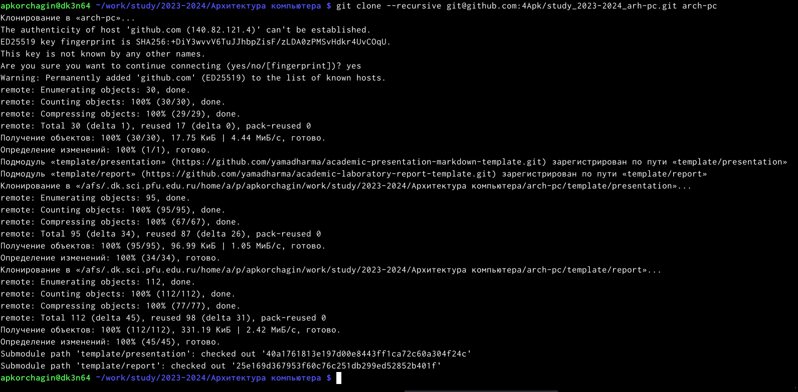
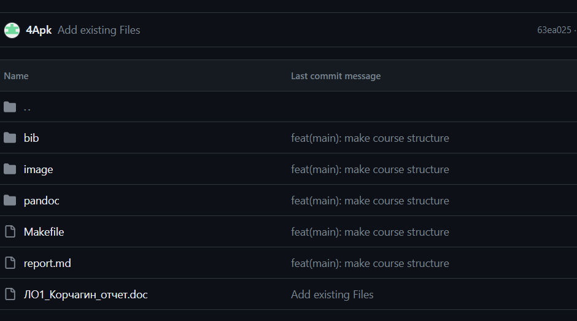

---
## Front matter
title: "Лабораторная работа №2"
subtitle: "Система контроля версии Git"
author: "Корчагин Алексей Павлович"

## Generic otions
lang: ru-RU
toc-title: "Содержание"

## Bibliography
bibliography: bib/cite.bib
csl: pandoc/csl/gost-r-7-0-5-2008-numeric.csl

## Pdf output format
toc: true # Table of contents
toc-depth: 2
lof: true # List of figures
lot: true # List of tables
fontsize: 12pt
linestretch: 1.5
papersize: a4
documentclass: scrreprt
## I18n polyglossia
polyglossia-lang:
  name: russian
  options:
	- spelling=modern
	- babelshorthands=true
polyglossia-otherlangs:
  name: english
## I18n babel
babel-lang: russian
babel-otherlangs: english
## Fonts
mainfont: PT Serif
romanfont: PT Serif
sansfont: PT Sans
monofont: PT Mono
mainfontoptions: Ligatures=TeX
romanfontoptions: Ligatures=TeX
sansfontoptions: Ligatures=TeX,Scale=MatchLowercase
monofontoptions: Scale=MatchLowercase,Scale=0.9
## Biblatex
biblatex: true
biblio-style: "gost-numeric"
biblatexoptions:
  - parentracker=true
  - backend=biber
  - hyperref=auto
  - language=auto
  - autolang=other*
  - citestyle=gost-numeric
## Pandoc-crossref LaTeX customization
figureTitle: "Рис."
tableTitle: "Таблица"
listingTitle: "Листинг"
lofTitle: "Список иллюстраций"
lotTitle: "Список таблиц"
lolTitle: "Листинги"
## Misc options
indent: true
header-includes:
  - \usepackage{indentfirst}
  - \usepackage{float} # keep figures where there are in the text
  - \floatplacement{figure}{H} # keep figures where there are in the text
---

# Цель работы

Целью работы является изучить идеологию и применение средств контроля версийю Приобрести практические навыки по работе с системой git

# Теоретическое введение

Git - это набор программ командной строки.
Доступ к ним можно получить из терминала посредством ввода команды git с различными опциями.
Git является диверсифецированной системой контроля версий. Резервную копию локального поэтому хранилища можно сделать простым копированием или архивацией

Системы контроля версий (Version Control System, VCS) используется при работе нескольких человек над одним проектом. Обычно основное дерево проекта хранится в локальном или удалённом репозитории, к которому настроен доступ для участников проекта. При внесении изменений в содержание проекта система контроля версий позволяет их фиксировать, совмещать изменения, произведённые разными участниками проекта, производить откат к любой более ранней версии проекта, если это требуется.

Среди стандартных VCS наиболее известны CVS, Subversion, а среди распределённых — Git, Bazaar, Mercurial. Принципы их работы схожи, отличаются они в основном синтаксисом
используемых в работе команд.

Если мы хотим сохранить все изменения в текущем каталоге, то используем:

git add .

Затем сохраняем изменения, поясняя, что было сделано:

git commit -am "Some commit message"

и отправляем в центральный репозиторий:

git push origin имя_ветки
или
git push

# Выполнение лабораторной работы

Создал аккаунт на Github (рис. @fig:001).

{#fig:001 width=70%}

Открываю виртуальную машину, затем открываю терминал и делаю пред- варительную конфигурацию git. Ввожу команду git config –global user.name “”, указывая свое имя и команду git config –global user.email “work@mail”, указывая в ней электронную почту владельца, то есть мою (рис. @fig:002).

{#fig:002 width=70%}

Настраиваю utf-8 в выводе сообщений git для корректного отображения сим- волов (рис. @fig:003).

{#fig:003 width=70%}

Задаю имя «master» для начальной ветки (рис. @fig:004).

{#fig:004 width=70%}

Задаю параметр autocrlf со значением input, так как я работаю в системе Linux, чтобы конвертировать CRLF в LF только при коммитах . CR и LF – это сим- волы, которые можно использовать для обозначения разрыва строки в текстовых файлах.(рис. @fig:005).

{#fig:005 width=70%}

Задаю параметр safecrlf со значением warn, так Git будет проверять преоб- разование на обратимость. При значении warn Git только выведет предупреждение, но будет принимать необратимые конвертации. (рис. @fig:006).

{#fig:006 width=70%}

Для последующей идентификации пользователя на сервере репозиториев необ- ходимо сгенерировать пару ключей (приватный и открытый). Для этого ввожу
команду ssh-keygen -C “Имя Фамилия, work@email”, указывая имя владельца и электронную почту владельца. Ключ автоматически сохранится в каталоге ~/.ssh/. (рис. @fig:007).

{#fig:007 width=70%}

Открываю браузер, захожу на сайт GitHub. Открываю свой профиль и выбираю страницу «SSH and GPG keys». Нажимаю кнопку «New SSH key» (рис. @fig:009).

{#fig:009 width=70%}

Вставляю скопированный ключ в поле «Key». В поле Title указываю имя для ключа. Нажимаю «Add SSH-key», чтобы завершить добавление ключа (рис. @fig:010).

{#fig:010 width=70%}

Закрываю браузер, открываю терминал. Создаю директорию, рабочее про- странство, с помощью утилиты mkdir, блягодаря ключу -p создаю все директории после домашней ~/work/study/2023-2024/“Архитектура компьютера” рекурсивно. Далее проверяю с помощью ls, действительно ли были созданы необходимые мне каталоги (рис. @fig:011).

{#fig:011 width=70%}

В браузере перехожу на страницу репозитория с шаблоном курса по адресу https://github.com/yamadharma/course-directory-student-template. Далее выбираю
«Use this template», чтобы использовать этот шаблон для своего репозитория (рис. @fig:012).

{#fig:012 width=70%}

В открывшемся окне задаю имя репозитория (Repository name): study_2023–2024_arh- pc и создаю репозиторий, нажимаю на кнопку «Create repository from template» (рис. @fig:013).

{#fig:013 width=70%}

Рипозиторий создан (рис. @fig:014).

{#fig:014 width=70%}

Через терминал перехожу в созданный каталог курса с помощью утилиты cd (рис. @fig:015).

{#fig:015 width=70%}

Клонирую созданный репозиторий с помощью команды git clone –recursive git@github.com:/study_2023–2024_arh-pc.git arch-pc (рис. @fig:016).

{#fig:016 width=70%}

Копирую ссылку для клонирования на странице созданного репозитория, сначала перейдя в окно «code», далее выбрав в окне вкладку “SSH” (рис. @fig:017).

{#fig:017 width=70%}

Перехожу в каталог arch-pc с помощью утилиты cd и удаляю лишние файлы при помощи rm (рис. @fig:018).

{#fig:018 width=70%}

Создаю необходимые каталоги (рис. @fig:019).

{#fig:019 width=70%}

Отправляю созданные каталоги с локального репозитория на сервер: добавляю все созданные каталоги с помощью git add, комментирую и сохраняю изменения на сервере как добавление курса с помощью git commit (рис. @fig:020).

{#fig:020 width=70%}

Отправляю все на сервер с помощью push (рис. @fig:021).

{#fig:021 width=70%}

Проверяю коректность выполнения работы сначала на самом сайте GitHub (рис. @fig:022).

{#fig:022 width=70%}

# Выполнение заданий для самостоятельной работы

Перехожу в директорию labs/lab02/report с помощью утилиты cd. Создаю в каталоге файл для отчета по второй лабораторной работе с помощью утилиты touch (рис. @fig:023).

{#fig:023 width=70%}

Оформить отчет я смогу в текстовом процессоре LibreOffice Writer (рис. @fig:024).

{#fig:024 width=70%}

Перехожу из подкаталога lab02/report в подкаталог lab01/report с помощью утилиты cd (рис. @fig:025).

{#fig:025 width=70%}

Проверяю местонахождение файла с отчетом по первой лабораторной работе. Он должен быть в подкаталоге домашней директории «Загрузки», для проверки использую команду ls (рис. @fig:026).

{#fig:026 width=70%}

Копирую первую лабораторную с помощью утилиты cp и проверяю коректность выполнения команды cp с помощью ls(рис. @fig:027).

{#fig:027 width=70%}

Добавляю с помощью команды git add в коммит созданные файлы: Л01_Корчагин_отчет (рис. @fig:028).

{#fig:028 width=70%}

Сохраняю изменения на сервере командой git commit -m “…”, поясняя, что добавила файлы (рис. @fig:029).

{#fig:029 width=70%}

То же самое делаю для отчета по второй лабораторной работе: перехожу в директорию labs/lab02/report с помощью cd, добавляю с помощью git add нужный файл, сохраняю изменения с помощью git commit (рис. @fig:030).

{#fig:030 width=70%}

Отправляю в центральный репозиторий сохраненные изменения командой git push -f origin master (рис. @fig:031).

{#fig:031 width=70%}

При просмотре изменений на Github вижу, что были добавлены файлы с отчетами по лабораторным работам (рис. @fig:032).

{#fig:032 width=70%}

(рис. @fig:033).

{#fig:033 width=70%}

# Выводы

При выполнении данной лабораторной работы я изучил идеи и при- менение средств контроля версий, а также приобрела практические навыки по работе	с системой git.

# Список литературы{.unnumbered}

::: {#refs}
:::
