---
## Front matter
title: "Отчёт по лабораторной работе №4"
subtitle: "Создание и процесс
обработки программ на языке ассемблера NASM"
author: "Алексей Павлович Корчагин"

## Generic otions
lang: ru-RU
toc-title: "Содержание"

## Bibliography
bibliography: bib/cite.bib
csl: pandoc/csl/gost-r-7-0-5-2008-numeric.csl

## Pdf output format
toc: true # Table of contents
toc-depth: 2
lof: true # List of figures
lot: true # List of tables
fontsize: 12pt
linestretch: 1.5
papersize: a4
documentclass: scrreprt
## I18n polyglossia
polyglossia-lang:
  name: russian
  options:
	- spelling=modern
	- babelshorthands=true
polyglossia-otherlangs:
  name: english
## I18n babel
babel-lang: russian
babel-otherlangs: english
## Fonts
mainfont: PT Serif
romanfont: PT Serif
sansfont: PT Sans
monofont: PT Mono
mainfontoptions: Ligatures=TeX
romanfontoptions: Ligatures=TeX
sansfontoptions: Ligatures=TeX,Scale=MatchLowercase
monofontoptions: Scale=MatchLowercase,Scale=0.9
## Biblatex
biblatex: true
biblio-style: "gost-numeric"
biblatexoptions:
  - parentracker=true
  - backend=biber
  - hyperref=auto
  - language=auto
  - autolang=other*
  - citestyle=gost-numeric
## Pandoc-crossref LaTeX customization
figureTitle: "Рис."
tableTitle: "Таблица"
listingTitle: "Листинг"
lofTitle: "Список иллюстраций"
lotTitle: "Список таблиц"
lolTitle: "Листинги"
## Misc options
indent: true
header-includes:
  - \usepackage{indentfirst}
  - \usepackage{float} # keep figures where there are in the text
  - \floatplacement{figure}{H} # keep figures where there are in the text
---

# Цель работы

Освоение процедуры компиляции и сборки программ, написанных на ассемблере NASM.

# Теоретическое введение
Основными функциональными элементами любой электронно-вычислительной машины (ЭВМ) являются центральный процессор, память и периферийные устройства. В состав центрльного процессора входят: арифметико-логическое устройство, устройство управления, регистры.

На иллюстрации ниже приведена структурная схема ЭВМ (рис. @fig:001).

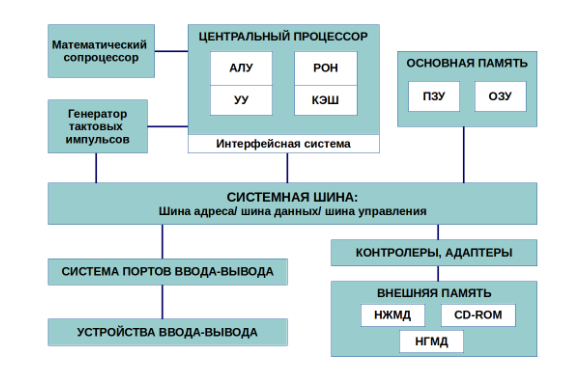{#fig:001 width=70%}

Программы, которые написаны на языке ассемблера, не уступают в качестве и превосходят по скорости, программам, написанным на машинном языке, так как транслятор просто переводит мнемонические обозначения команд в числовые последовательности бит (нулей и единиц).
Используемые мнемоники обычно одинаковы для всех процессоров одной архитектуры
или семейства архитектур (среди широко известных — мнемоники процессоров и контрол-
леров x86, ARM, SPARC, PowerPC,M68k). Таким образом для каждой архитектуры существует
свой ассемблер и свой язык ассемблера.
Наиболее распространёнными ассемблерами для архитектуры x86 являются:
• для DOS/Windows: Borland Turbo Assembler (TASM), Microsoft Macro Assembler (MASM) и
Watcom assembler (WASM);
• для GNU/Linux: gas (GNU Assembler), использующий AT&T-синтаксис, в отличие от
большинства других популярных ассемблеров, которые используют Intel-синтаксис.

# Выполнение лабораторной работы

Создаю каталог lab04 (рис. @fig:002).

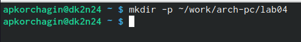{#fig:002 width=70%}

Перехожу в каталог lab04(рис. @fig:003).

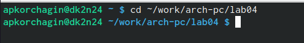{#fig:003 width=70%}

Создаю текстовый файл с именнем hello.asm(рис. @fig:004).

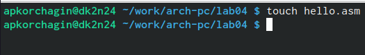{#fig:004 width=70%}

открываю файл hello.asm и копирую текст в файл hello.asm(рис. @fig:005).

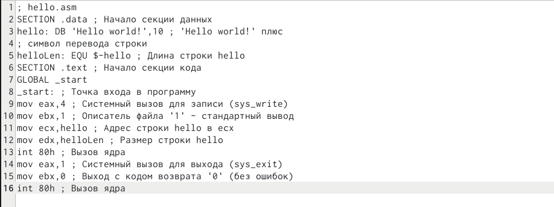{#fig:005 width=70%}

Превращаю файл hello.asm в объектный код, объектный файл называется hello.o (рис. @fig:006).

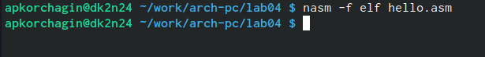{#fig:006 width=70%}

Проверяю коректность выполненния предидущей команды (рис. @fig:007).

{#fig:007 width=70%}

Компилирую файл hello.asm в obj.o и создаю файл list.lst (рис. @fig:008).

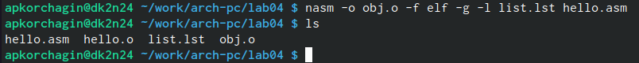{#fig:008 width=70%}

Передаю файл hello.o на обработку компановщику(рис. @fig:009).

{#fig:009 width=70%}

Передаю файл obj.o на обработку компановщику, исполняёмый файл будет называться main, а объектный файл будет называться obj.o (рис. @fig:010).

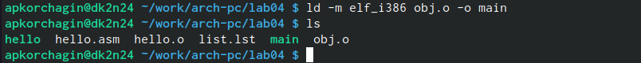{#fig:011 width=70%}

Запускаю на выполнение созданный исполняемый файл (рис. @fig:011).

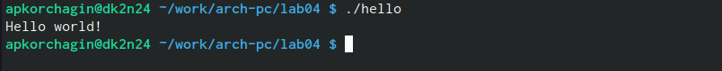{#fig:011 width=70%}

# Задания самостоятельной работы

Создаю файл с новым названием (рис. @fig:012).

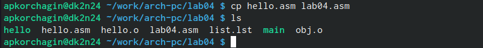{#fig:012 width=70%}

Вношу изменения текста в файл lab04(рис. @fig:013).

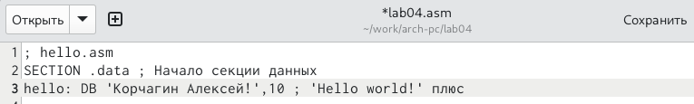{#fig:013 width=70%}

Транслирую текст в объектный файл (рис. @fig:014).

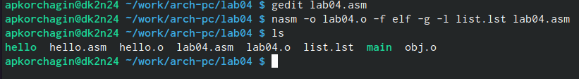{#fig:014 width=70%}

Выполняю компановку объектного файла (рис. @fig:015).

{#fig:015 width=70%}

Запускаю файл (рис. @fig:016).

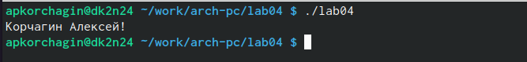{#fig:016 width=70%}

Копирую файл в другой каталог(рис. @fig:017).

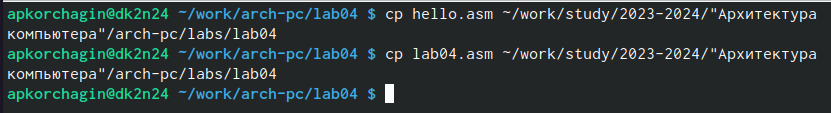{#fig:017 width=70%}

# Выводы

В ходе выполнения лаборотрной работы я освоил процедуры компиляции и сборки программ, написанных на ассемблере NASM.

# Список литературы{.unnumbered}

::: {#refs}
:::
