---
## Front matter
title: "Отчет по лабораторной работе №6"
subtitle: "Арифметические операции в NASM."
author: "Корчагин Алексей Павлович"

## Generic otions
lang: ru-RU
toc-title: "Содержание"

## Bibliography
bibliography: bib/cite.bib
csl: pandoc/csl/gost-r-7-0-5-2008-numeric.csl

## Pdf output format
toc: true # Table of contents
toc-depth: 2
lof: true # List of figures
lot: true # List of tables
fontsize: 12pt
linestretch: 1.5
papersize: a4
documentclass: scrreprt
## I18n polyglossia
polyglossia-lang:
  name: russian
  options:
	- spelling=modern
	- babelshorthands=true
polyglossia-otherlangs:
  name: english
## I18n babel
babel-lang: russian
babel-otherlangs: english
## Fonts
mainfont: PT Serif
romanfont: PT Serif
sansfont: PT Sans
monofont: PT Mono
mainfontoptions: Ligatures=TeX
romanfontoptions: Ligatures=TeX
sansfontoptions: Ligatures=TeX,Scale=MatchLowercase
monofontoptions: Scale=MatchLowercase,Scale=0.9
## Biblatex
biblatex: true
biblio-style: "gost-numeric"
biblatexoptions:
  - parentracker=true
  - backend=biber
  - hyperref=auto
  - language=auto
  - autolang=other*
  - citestyle=gost-numeric
## Pandoc-crossref LaTeX customization
figureTitle: "Рис."
tableTitle: "Таблица"
listingTitle: "Листинг"
lofTitle: "Список иллюстраций"
lotTitle: "Список таблиц"
lolTitle: "Листинги"
## Misc options
indent: true
header-includes:
  - \usepackage{indentfirst}
  - \usepackage{float} # keep figures where there are in the text
  - \floatplacement{figure}{H} # keep figures where there are in the text
---

# Цель работы

Цель лабораторной работы - освоение арифметческих инструкций языка ассемблера NASM.

# Теоретическое введение

Большая часть инструкций на языке ассемблера требуют обработки операндов. Адрес операнда предоставляет место, где хранятся данные, подлежащие обработке. Это могут быть данные хранящиеся в регистре или в ячейке памяти.

Основные способы адресации в NASM:

    Регистровая адресация – операнды хранятся в регистрах и в команде используются имена этих регистров, например: mov ax,bx.
    Непосредственная адресация – значение операнда задается непосредственно в команде, Например: mov ax,2.
    Адресация памяти – операнд задает адрес в памяти. В команде указывается символическое обозначение ячейки памяти, над содержимым которой требуется выполнить операцию.

Арифметические операции в NASM:

    Целочисленное сложение - add.
    Целочисленное вычитание - sub.
    Команды инкремент(inc)- прибавление единицы к операнду и декремент(dec)- вычитание единицы. Они выгодны тем, что они занимают меньше места, чем соответствующие команды сложения и вычитания.
    Команда изменения знака операнда - neg.
    Команды умножения - mul (для беззнакового умножения) и imul (для знакового умножения).
    Команды деления div и idiv.

Ввод информации с клавиатуры и вывод её на экран осуществляется в символьном виде. Кодирование этой информации производится согласно кодовой таблице символов ASCII. Согласно стандарту ASCII каждый символ кодируется одним байтом. Среди инструкций NASM нет такой, которая выводит числа (не в символьном виде). Поэтому, например, чтобы вывести число, надо предварительно преобразовать его цифры в ASCII-коды этих цифр и выводить на экран эти коды, а не само число. Если же выводить число на экран непосредственно, то экран воспримет его не как число, а как последовательность ASCII-символов – каждый байт числа будет воспринят как один ASCII-символ – и выведет на экран эти символы. Аналогичная ситуация происходит и при вводе данных с клавиатуры. Введенные данные будут представлять собой символы, что сделает невозможным получение корректного результата при выполнении над ними арифметических операций. Для решения этой проблемы необходимо проводить преобразование ASCII символов в числа и обратно
# Выполнение лабораторной работы

Создал каталог для программам лабораторной работы No 6, перешёл в него и создал файл (рис. @fig:001).

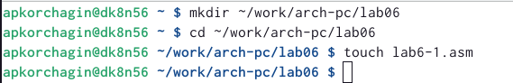{#fig:001 width=70%}

Скопировал в текущий каталог файл in_out.asm с помощью команды cp, т.к. он будет использоваться в других программах(рис. @fig:002).

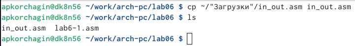{#fig:002 width=70%}

Открываю файл lab6-1.asm и ввожу в него программу вывода значения регистра eax(рис. @fig:003).

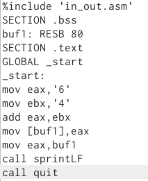{#fig:003 width=70%}

Создайте исполняемый файл и запустите его. Вывод программы: символ j, потому что программа вывела символ, соответствующий по системе ASCII сумме двоичных кодов символов 4 и 6 (рис. @fig:004).

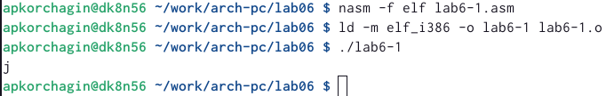{#fig:004 width=70%}

Изменяю в тексте программы символы “6” и “4” на цифры 6 и 4 (рис. @fig:005).

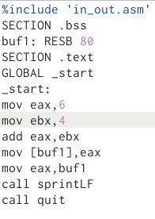{#fig:005 width=70%}

Создаю новый исполняемый файл программы и запускаю его. Выводится символ с кодом 10, это символ перевода строки. Этот символ не отображается при выводе на экран(рис. @fig:006).

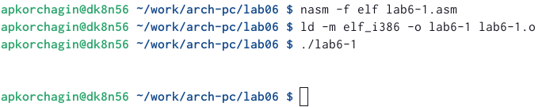{#fig:006 width=70%}

Создаю новый файл и lab6-2.asm и вписываю в него код(рис. @fig:007).

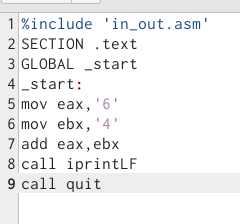{#fig:007 width=70%}

Создаю и запускаю исполняемый файл lab6-2. Теперь вывод число 106, потому что программа позволяет вывести именно число, а не символ, хотя все еще происходит именно сложение кодов символов “6” и “4” (рис. @fig:008).

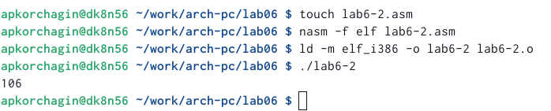{#fig:008 width=70%}

Заменяю в тексте программы в файле lab6-2.asm символы “6” и “4” на числа 6 и 4(рис. @fig:009).

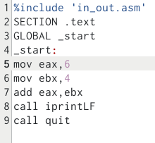{#fig:009 width=70%}

Создаю и запускаю новый исполняемый файл. Теперь программа складывает не соответствующие символам коды в системе ASCII, а сами числа, поэтому вывод 10 (рис. @fig:010).

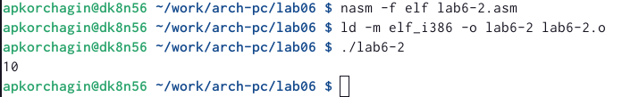{#fig:010 width=70%}

Заменяю в тексте программы функцию iprintLF на iprint (рис. @fig:011).

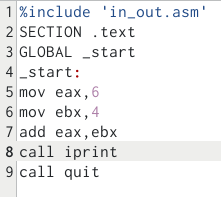{#fig:011 width=70%}

Создаю и запускаю новый исполняемый файл. Вывод не изменился, потому что символ переноса строки не отображался, когда программа исполнялась с функцией iprintLF, а iprint не добавляет к выводу символ переноса строки, в отличие от iprintLF.(рис. @fig:012).

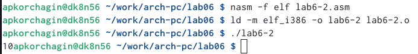{#fig:012 width=70%}

Создаю файл lab6-3.asm (рис. @fig:013).

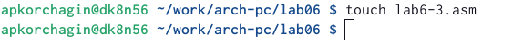{#fig:013 width=70%}

Ввожу в созданный файл текст программы для вычисления значения выражения (5 * 2 + 3)/3(рис. @fig:014).

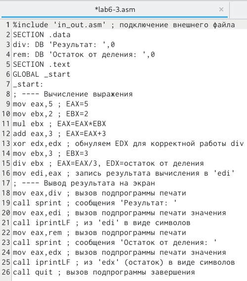{#fig:014 width=70%}

Создаю исполняемый файл и запускаю его (рис. @fig:015).

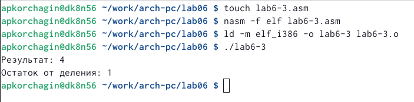{#fig:015 width=70%}

Изменяю программу так, чтобы она вычисляла значение выражения  (4 * 6 + 2)/5 (рис. @fig:016).

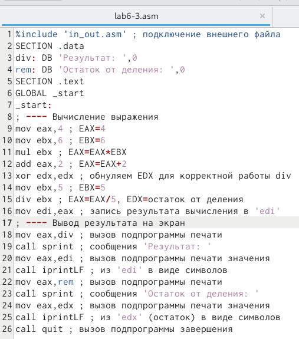{#fig:016 width=70%}

Создаю и запускаю новый исполняемый файл (рис. @fig:017).

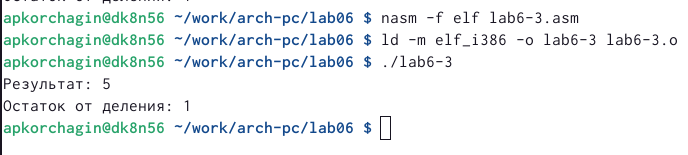{#fig:017 width=70%}

Создаю файл variant.asm (рис. @fig:018).

{#fig:018 width=70%}

Ввожу в файл текст программы для вычисления варианта задания по номеру студенческого билета (рис. @fig:019).

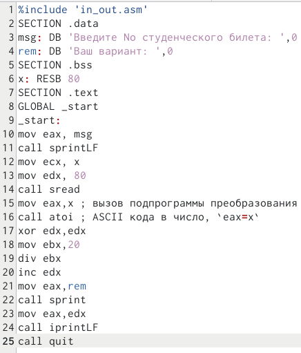{#fig:019 width=70%}

Создаю и запускаю исполняемый файл. Ввожу номер своего студ. билета с клавиатуры, программа вывела, что мой вариант - 2(рис. @fig:020).

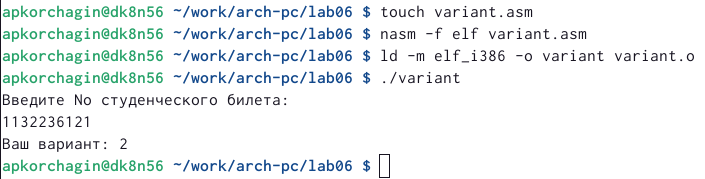{#fig:020 width=70%}
# Ответы на вопросы

1:
За вывод сообщения “Ваш вариант” отвечают строки кода: mov eax,rem call sprint.

2: 
mov ecx, x - используется, чтобы положить адрес вводимой строки x в регистр ecx mov edx80    - запись в регистр edx длины вводимой строки call sread - вызов подпрограммы из внешнего файла, обеспечивающей ввод сообщения с клавиатуры.

3:
call atoi - вызов подпрограммы из внешнего файла, которая преобразует ascii-код символа в целое число и записывает результат в регистр eax.

4:
За вычисления варианта отвечают строки: xor edx,edx ; обнуление edx для корректной работы div mov ebx,20 ; ebx = 20 div ebx ; eax = eax/20, edx - остаток от деления inc edx ; edx = edx + 1.

5:
При выполнении инструкции div ebx остаток от деления записывается в регистр edx.

6:
Инструкция inc edx прибавляет 1 к значению регистра edx.

7:
За вывод на экран результатов вычислений отвечают строки: mov eax,edx call iprintLF.

# Задания самстоятельной работы

Создаю файл lab6-4.asm (рис. @fig:021).

{#fig:021 width=70%}

Открываю созданный файл для редактирования, ввожу в него текст программы для вычисления значения выражения (12x+3)/5(рис. @fig:022).

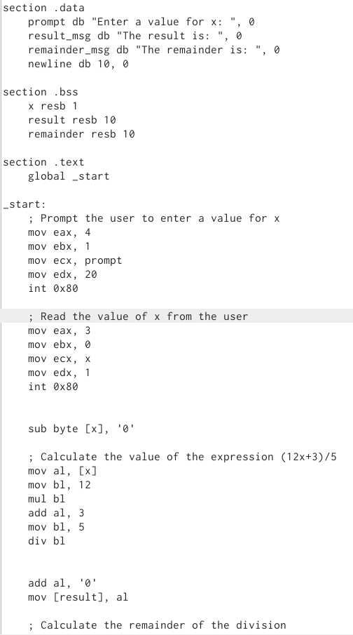{#fig:022 width=70%}

Создаю и запускаю исполняемый файл. Проверяю с значеннием из задания(рис. @fig:023).

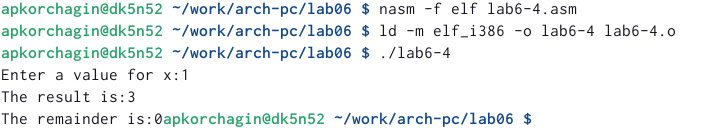{#fig:023 width=70%}

#Листинг программы

    1_Старт программы и задание приветственного сообщенния
section .data
    prompt db "Enter a value for x: ", 0
    result_msg db "The result is: ", 0
    remainder_msg db "The remainder is: ", 0
    newline db 10, 0
    
    2_Задание переменной x
section .bss
    x resb 1
    result resb 10
    remainder resb 10

section .text
    global _start

_start:
    3_Вывод приветсвенного сообщенния
    mov eax, 4
    mov ebx, 1
    mov ecx, prompt
    mov edx, 20
    int 0x80

    4_Считыванние переменной x
    mov eax, 3
    mov ebx, 0
    mov ecx, x
    mov edx, 1
    int 0x80

    sub byte [x], '0'

    5_Вычисленние значенния выраженния (12x+3)/5 для введённого x
    mov al, [x]
    mov bl, 12
    mul bl
    add al, 3
    mov bl, 5
    div bl

    
    add al, '0'
    mov [result], al

    6_Вычисленние остатка от деленния
    mov al, ah
    add al, '0'
    mov [remainder], al

    7_Вывод остатка и результата вычисленния выраженния в консоль
    mov eax, 4
    mov ebx, 1
    mov ecx, result_msg
    mov edx, 14
    int 0x80

    mov eax, 4
    mov ebx, 1
    mov ecx, result
    mov edx, 1
    int 0x80

    mov eax, 4
    mov ebx, 1
    mov ecx, newline
    mov edx, 1
    int 0x80

    mov eax, 4
    mov ebx, 1
    mov ecx, remainder_msg
    mov edx, 17
    int 0x80

    mov eax, 4
    mov ebx, 1
    mov ecx, remainder
    mov edx, 1
    int 0x80

    8_Завершенние программы
    mov eax, 1
    xor ebx, ebx
    int 0x80

# Выводы

Я научился выполнять базовые арифметические дейстия при программирование на языке Ассемблера NASM

# Список литературы{.unnumbered}

::: {#refs}
:::
