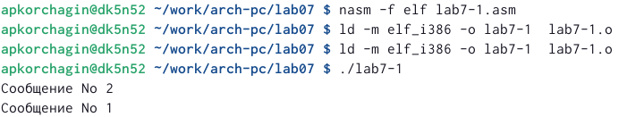
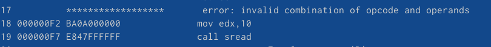

---
## Front matter
title: "Отчет по лабораторной работе №7"
subtitle: " Команды безусловного и условного переходов в Nasm. Программирование ветвлений."
author: "Корчагин Алексей Павлович"

## Generic otions
lang: ru-RU
toc-title: "Содержание"

## Bibliography
bibliography: bib/cite.bib
csl: pandoc/csl/gost-r-7-0-5-2008-numeric.csl

## Pdf output format
toc: true # Table of contents
toc-depth: 2
lof: true # List of figures
lot: true # List of tables
fontsize: 12pt
linestretch: 1.5
papersize: a4
documentclass: scrreprt
## I18n polyglossia
polyglossia-lang:
  name: russian
  options:
	- spelling=modern
	- babelshorthands=true
polyglossia-otherlangs:
  name: english
## I18n babel
babel-lang: russian
babel-otherlangs: english
## Fonts
mainfont: PT Serif
romanfont: PT Serif
sansfont: PT Sans
monofont: PT Mono
mainfontoptions: Ligatures=TeX
romanfontoptions: Ligatures=TeX
sansfontoptions: Ligatures=TeX,Scale=MatchLowercase
monofontoptions: Scale=MatchLowercase,Scale=0.9
## Biblatex
biblatex: true
biblio-style: "gost-numeric"
biblatexoptions:
  - parentracker=true
  - backend=biber
  - hyperref=auto
  - language=auto
  - autolang=other*
  - citestyle=gost-numeric
## Pandoc-crossref LaTeX customization
figureTitle: "Рис."
tableTitle: "Таблица"
listingTitle: "Листинг"
lofTitle: "Список иллюстраций"
lotTitle: "Список таблиц"
lolTitle: "Листинги"
## Misc options
indent: true
header-includes:
  - \usepackage{indentfirst}
  - \usepackage{float} # keep figures where there are in the text
  - \floatplacement{figure}{H} # keep figures where there are in the text
---

# Цель работы

Изучить команды условных и безусловных переходов. Преобрести наввыки написания программ с использованием переходов. Познакомится с назаначением и структурой файла

# Теоретическое введение

В Ассемблере безусловный переход выполняется с помощью инструкции jmp, она включает в себя адрес перехода, то-есть куда следует передать управление: jmp <адрес_перехода>

jmp label - переход на метку label jmp (label в квадратных скобках) - переход по адресу в памяти, помеченному меткой label jmp eax - переход по адресу из регистра eax

Как показанно выше, для условного перехода необходима проверка какого-либо условия. В ассемблере команды условного перехода вычисляют условие перехода анализируя флаги из регистра флагов. Флаг – это бит, принимающий значение 1 («флаг установлен»), если выполнено некоторое условие, и значение 0 («флаг сброшен») в противном случае. Флаги работают независимо друг от друга, и лишь для удобства они помещены в единый регистр — регистр флагов, отражающий текущее состояние процессора (такие как CF PF AF ZF SF)

Инструкция cmp является одной из инструкций, которая позволяет сравнить операнды и выставляет флаги в зависимости от результата сравнения. Инструкция cmp является командой сравнения двух операндов: cmp <операнд_1>, <операнд_2> Команда cmp, так же как и команда вычитания, выполняет вычитание <операнд_2> - <операнд_1>, но результат вычитания никуда не записывается и единственным результатом команды сравнения является формирование флагов.

Листинг (в рамках понятийного аппарата NASM) — это один из выходных файлов, создаваемых транслятором. Все ошибки и предупреждения, обнаруженные при ассемблировании, транслятор выводит на экран, и файл листинга не создаётся. Структура листинга:

    номер строки
    адрес — это смещение машинного кода от начала текущего сегмента
    машинный код представляет собой ассемблированную исходную строку в виде шестнадцатеричной последовательности
    исходный текст программы

# Выполнение лабораторной работы

 Создал каталог для программ необходимых для выполненния лабараторной работы №7, также создал файл lab7-1.asm(рис. @fig:001).

{#fig:001 width=70%}

Ввёл текст программы в файл lab7-1.asm(рис. @fig:002).

{#fig:002 width=70%}

Создаю исполняемый файл и запускаю его (рис. @fig:003).

{#fig:003 width=70%}

Изменяю текст программы, чтобы она выводила сначала ‘Сообщение № 2’, потом ‘Сообщение№ 1’ и завершала работу(рис. @fig:004).

{#fig:004 width=70%}

Создаю исполняемый файл и запускаю его(рис. @fig:005).

{#fig:005 width=70%}

Изменяю текст программы, чтобы она выводила сначала ‘Сообщение № 3’, потом ‘Сообщение№ 2’, а затем ‘Сообщение № 1’ (рис. @fig:006).

{#fig:006 width=70%}

Создал и запусти исполняймый файл(рис. @fig:007).

{#fig:007 width=70%}

Создал файл lab7-2.asm и ввёл в файл lab7-2.asm текст программы, которая определяет и выводит на экран наибольшую из целочисленных переменных: A,B и C(рис. @fig:008).

{#fig:008 width=70%}

Создаю исполняемый файл и запускаю его несколько раз для разных значений В, чтобы проверить его работу(рис. @fig:009).

{#fig:009 width=70%}

Создаю файл листинга для программы из файла lab7-2.asm, указав ключ -l(рис. @fig:010).

{#fig:010 width=70%}

Открываю файл листинга lab7-2.lst (рис. @fig:011).

{#fig:011 width=70%}

Объяснение содержимого трёх строк файла листинга:

10 строка:
Перые цифры [10] - это номер строки файла листинга.
Cледующие цифры [00000008] адрес — это смещение машинного кода от начала текущего сегмента, состоит из 8 чисел.
следующие числа [40] - это машинный код, который представляет собой ассемблированную исходную строку в виде шестнадцатеричной последовательности, поэтоу и появляются буквы латынского алфавита.
следющее [inc eax] - исходный текст программы, которая просто состоит из строкк исходной программы вместе с комментариями

11 строка:
Перые цифры [11] - это номер строки файла листинга.
Cледующие цифры [00000009] адрес — это смещение машинного кода от начала текущего сегмента, состоит из 8 чисел. следующие числа [EBF8] - это машинный код, который представляет собой ассемблированную исходную строку в виде шестнадцатеричной последовательности, поэтоу и появляются буквы латынского алфавита.
следющее [jmp nextchar] - исходный текст программы, которая просто состоит из строкк исходной программы вместе с комментариями

12 строка:
содержит номер сторки [11], адресс [00000009], машинный код [EBF8] и содержимое строки кода [jmp nextchar]

Открываю файл с программой lab7-2.asm и в одной из инструкций с двумя операндами удаляю один операнд(рис. @fig:012).

{#fig:012 width=70%}

Пробую выполнить трансляцию с получением файла листинга(рис. @fig:013).

{#fig:013 width=70%}

В листинге, как и в коде, появилась ошибка(рис. @fig:014).

{#fig:014 width=70%}

# Задание Самостоятельной работы

Создал файл lab7-3.asm и написал в нём программу, значения взял из примера моего варианта, тоесть из примера второго варианта (рис. @fig:016).

{#fig:016 width=70%}

Создал исполняемый файл и проверил его работу. Все работает коректно (рис. @fig:017).

{#fig:017 width=70%}

Код программы:

%include 'in_out.asm'
section .data
msg1 db ' а = ',0h
msg2 db ' b = ',0h
msg3 db ' c = ',0h
msg4 db "Минимальное число: ",0h
a dd '82'
b dd '59'
c dd '61'

section .bss
max resb 10

section .text
global _start
_start:
; ---------- Вывод чисел: 
mov eax,msg1
call sprint
mov eax,a
call atoi
call iprintLF

mov eax,msg2
call sprint
mov eax,b
call atoi
call iprintLF

mov eax,msg3
call sprint
mov eax,c
call atoi
call iprintLF

;-------------Сравнение чисел
mov eax,b
call atoi ;перевод символа в число
mov [b],eax ; запись преобразованного числа в b
;------------ запись b в переменную мах
mov ecx,[a] ;
mov [max],ecx ;
;------------сравнение чисел a c
cmp ecx,[c]; if a>c
jl check_b ; то перход на метку
mov ecx,[c] ;
mov [max],ecx ;
;-------метка check_b
check_b:
mov eax,max ;
call atoi
mov [max],eax ;
;------------
mov ecx,[max] ;
cmp ecx,[b] ;
jl check_c ;
mov ecx,[b] ;
mov [max],ecx ;
;-------------
check_c:
mov eax,msg4 ;
call sprint ; 
mov eax,[max];
call iprintLF ;
call quit

2 Задание самостоятельной работы

Создал файл lab7-4.asm и написал в нйм программу, которая для введенных с клавиатуры значений x и a вычисляет значение функции f(x) и выводит результат вычислений.  (рис. @fig:018).

{#fig:018 width=70%}

Создал иполняймый файл и провёл тест с первой парой значений для варианта 2(рис. @fig:019).

{#fig:019 width=70%}

Тестирую со второй парой занченний(рис. @fig:020).

{#fig:020 width=70%}

Код программы
%include 'in_out.asm'
section .data
msg1 db 'Введите x: ',0h
msg2 db 'Введите a: ',0h
msg3 db 'f(x) = ',0h

section .bss
x resb 10
a resb 10

section .text
global _start
_start:
mov eax,msg1
call sprint
mov ecx,x
mov edx,10
call sread
mov eax,x
;----------
call atoi
mov [x],eax
;-----------

mov eax,msg2
call sprint
mov ecx,a
mov edx,10
call sread
mov eax,a ;
call atoi
mov [a],eax ;
;----------
mov ecx,[a]
cmp ecx,[x] ;x<a
jg check_a ;
mov ecx,[x]
check_a:
add ecx,-1;
mov eax,msg3 ;
call sprint ;
mov eax,ecx ;
call iprintLF;
call quit ;

# Выводы

По ходу выполнения лабороторной работы я изучил команды условных и безусловных переходов в Ассемблере.

# Список литературы{.unnumbered}

::: {#refs}
:::
