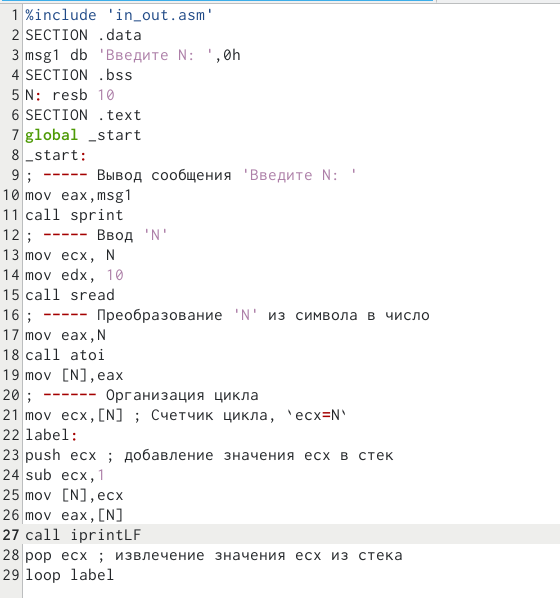

---
## Front matter
title: "Отчёт по лабораторной работе №8"
subtitle: "Программирование цикла. Обработка аргументов командной строки."
author: "Корчагин Алексей Павлоаич"

## Generic otions
lang: ru-RU
toc-title: "Содержание"

## Bibliography
bibliography: bib/cite.bib
csl: pandoc/csl/gost-r-7-0-5-2008-numeric.csl

## Pdf output format
toc: true # Table of contents
toc-depth: 2
lof: true # List of figures
lot: true # List of tables
fontsize: 12pt
linestretch: 1.5
papersize: a4
documentclass: scrreprt
## I18n polyglossia
polyglossia-lang:
  name: russian
  options:
	- spelling=modern
	- babelshorthands=true
polyglossia-otherlangs:
  name: english
## I18n babel
babel-lang: russian
babel-otherlangs: english
## Fonts
mainfont: PT Serif
romanfont: PT Serif
sansfont: PT Sans
monofont: PT Mono
mainfontoptions: Ligatures=TeX
romanfontoptions: Ligatures=TeX
sansfontoptions: Ligatures=TeX,Scale=MatchLowercase
monofontoptions: Scale=MatchLowercase,Scale=0.9
## Biblatex
biblatex: true
biblio-style: "gost-numeric"
biblatexoptions:
  - parentracker=true
  - backend=biber
  - hyperref=auto
  - language=auto
  - autolang=other*
  - citestyle=gost-numeric
## Pandoc-crossref LaTeX customization
figureTitle: "Рис."
tableTitle: "Таблица"
listingTitle: "Листинг"
lofTitle: "Список иллюстраций"
lotTitle: "Список таблиц"
lolTitle: "Листинги"
## Misc options
indent: true
header-includes:
  - \usepackage{indentfirst}
  - \usepackage{float} # keep figures where there are in the text
  - \floatplacement{figure}{H} # keep figures where there are in the text
---

# Цель работы

Приобретение навыков написания программ с использованием циклов и обработкой
аргументов командной строки.

# Теоретическое введение

##Стек — абстрактный тип данных, представляющий собой список элементов, организованных по принципу LIFO(Первым вошёл последним вышел). Стек является частью архитектуры процессора и реализован на аппаратном уровне. Для работы со стеком в процессоре есть специальные регистры (ss, bp, sp) и команды. Основая функция стека - сохранение адресов возврата и передачи аргументов при вызове процедур. Кроме того, в нём выделяется память для локальных переменных и могут временно храниться значения регистров. Стек имеет вершину (адрес последнего добавленного элемента, который хранится в ре- гистре esp (указатель стека)) и дно (противоположный конец стека). Значение, помещённое в стек последним, извлекается первым. При помещении значения в стек указатель стека уменьшается, а при извлечении — увеличивается. Для стека существует две основные операции:

    добавление элемента в вершину стека (push);
    извлечение элемента из вершины стека (pop).


# Выполнение лабораторной работы

Создал каталог для программ требуемых для выполненния №8 и перешёл в него и создал файл lab8-1.asm(рис. @fig:001).

{#fig:001 width=70%}

Ввёл в файл lab8-1.asm текст программы из листинга (рис. @fig:002).

{#fig:002 width=70%}


Проверил работу файла(рис. @fig:003).

{#fig:003 width=70%}


Изменил текст программы, добавил значения регистра ecx в цикле(рис. @fig:004).

{#fig:004 width=70%}


Проверил работу файла, программа выводит значенния через еденицу, получается не n значенний а n/2(рис. @fig:005).

.

{#fig:006 width=70%}


Запустил программу, теперь она работает коректно(рис. @fig:007).

{#fig:007 width=70%}


Создал файл lab8-2.asm(рис. @fig:008).

{#fig:008 width=70%}


Ввёл текст программы в файл lab8-2.asm(рис. @fig:009).

{#fig:009 width=70%}

Запустил файл, указав аргументы(рис. @fig:010).

{#fig:010 width=70%}

Создал файл lab8-3.asm(рис. @fig:011).

{#fig:011 width=70%}


Ввёл текст программф в файл lab8-3.asm(рис. @fig:012).

{#fig:012 width=70%}


Создал и запустил исполняймый файл ввёл числа от 1 до 5, получил 15(рис. @fig:013).

{#fig:013 width=70%}

Изменил код в файле так чтбоы программа выводила не сумму, а произведенние(рис. @fig:014).

{#fig:014 width=70%}


Создал исполняймый файл и запустил программу, ввё числа от 1 до 5, Программа посчитала произвиденние коректно(рис. @fig:015).

{#fig:015 width=70%}


# Выполненние самостоятельной работы

Создал файл lab8-4.asm(рис. @fig:016).

{#fig:016 width=70%}


Ввёл в созданный файл текст программы,программа находит сумму значений функции f(x)=3x-1 (2 Вариант) для всех введённых пользовтелем аргументов x.(рис. @fig:017).

{#fig:017 width=70%}


Создал исполняймый файл и проверил коректность работы программы(рис. @fig:018).

{#fig:018 width=70%}
Код программый

```NASM
%include 'in_out.asm'
SECTION .data
msg db "Результат: ",0
msg1 db "Функция: f(x)=3x-1"
SECTION .text
global _start
_start:
pop ecx ; Извлеченние из стека в `ecx` кол-во
; аргументов 
pop edx ; Извлеченние из стека в `edx` имя программы
sub ecx,1 ; Уменьшенние `ecx` на 1 (кол-во
; аргументов без названия программы)
mov esi, 0 ; Используем `esi` для хранения
; промежуточных сумм
next:
cmp ecx,0h ; проверка, есть ли еще аргументы
jz _end ; если аргументов нет выходим из цикла
; (переход на метку `_end`)
pop eax ; иначе берём следующий аргумент из стека
call atoi ; преобразовывание символа в число
mov ebx,3 ;ebx=3
mul ebx; eax=eax*ebx
sub eax,1 ; eax-1
add esi,eax ; добавленние к промежуточной сумме
; след. аргумент `esi=esi+eax`
loop next ; переход к обработке следующего аргумента
_end:
mov eax,msg1 ;
call sprintLF ;
mov eax, msg ; вывод сообщения "Результат: "
call sprint
mov eax, esi ; записываем сумму в регистр `eax`
call iprintLF ; вывод результата
call quit ; завершение программы
```


# Выводы

В ходе выполениния работы,я получил навыки по организации циклов, и опыт работы со стеком на языке NASM.


