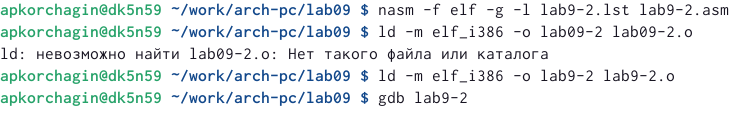

---
## Front matter
title: "Отчёт по лабараторной работе №9"
subtitle: " Понятие подпрограммы. Отладчик GDB."
author: "Корчаги Алексей Павлович"

## Generic otions
lang: ru-RU
toc-title: "Содержание"

## Bibliography
bibliography: bib/cite.bib
csl: pandoc/csl/gost-r-7-0-5-2008-numeric.csl

## Pdf output format
toc: true # Table of contents
toc-depth: 2
lof: true # List of figures
lot: true # List of tables
fontsize: 12pt
linestretch: 1.5
papersize: a4
documentclass: scrreprt
## I18n polyglossia
polyglossia-lang:
  name: russian
  options:
	- spelling=modern
	- babelshorthands=true
polyglossia-otherlangs:
  name: english
## I18n babel
babel-lang: russian
babel-otherlangs: english
## Fonts
mainfont: PT Serif
romanfont: PT Serif
sansfont: PT Sans
monofont: PT Mono
mainfontoptions: Ligatures=TeX
romanfontoptions: Ligatures=TeX
sansfontoptions: Ligatures=TeX,Scale=MatchLowercase
monofontoptions: Scale=MatchLowercase,Scale=0.9
## Biblatex
biblatex: true
biblio-style: "gost-numeric"
biblatexoptions:
  - parentracker=true
  - backend=biber
  - hyperref=auto
  - language=auto
  - autolang=other*
  - citestyle=gost-numeric
## Pandoc-crossref LaTeX customization
figureTitle: "Рис."
tableTitle: "Таблица"
listingTitle: "Листинг"
lofTitle: "Список иллюстраций"
lotTitle: "Список таблиц"
lolTitle: "Листинги"
## Misc options
indent: true
header-includes:
  - \usepackage{indentfirst}
  - \usepackage{float} # keep figures where there are in the text
  - \floatplacement{figure}{H} # keep figures where there are in the text
---

# Цель работы

Приобретение навыков написания программ с использованием подпрограмм. Знакомство
с методами отладки при помощи GDB и его основными возможностями.

# Теоретическое введение

Отладка — это процесс поиска и исправления ошибок в программе. В общем случае его
можно разделить на три этапа:
• посик ошибки;
• определение причины ошибки;
• исправление ошибки.

GDB — отладчик проекта GNU  работает на большенстве UNIX-подобных
системах и может проводить процесс отладки для кода написанного на многих языках программирования. 
GDB предлагает
обширные средства для слежения и контроля за выполнением компьютерных программ. От-
ладчик не содержит собственного графического пользовательского интерфейса и использует
стандартный текстовый интерфейс консоли. Однако для GDB существует несколько сторон-
них графических надстроек, а кроме того, некоторые интегрированные среды разработки
используют его в качестве базовой подсистемы отладки.
Отладчик GDB (как и любой другой отладчик) позволяет увидеть, что происходит «внутри»
программы в момент её выполнения или что делает программа в момент сбоя.
GDB может выполнять следующие действия:
• начать выполнение программы, задав всё, что может повлиять на её поведение;
• остановить программу при указанных условиях;
• исследовать, что случилось, когда программа остановилась

# Выполнение лабораторной работы

Создал директорию и файл для выполненние лаборотной работы(рис. @fig:001).

{#fig:001 width=70%}

Записал код в файл lab9-1.asm(рис. @fig:002).

{#fig:002 width=70%}

Проверил работу программы(рис. @fig:003).

{#fig:003 width=70%}

(рис. @fig:004).

{#fig:004 width=70%}

Создал файл lab9-2.asm(рис. @fig:005).

{#fig:005 width=70%}

Записал код в файл(рис. @fig:006).

{#fig:006 width=70%}

Ассемблирол файл lab9-2.asm, чтобы открыть файл через gdb(рис. @fig:007).

{#fig:007 width=70%}

Открыл файл lab9-2.asm через gdb(рис. @fig:008).

{#fig:008 width=70%}

Поставил breakpoint на _start(рис. @fig:009).

{#fig:009 width=70%}

Начал просмотр дизассемблированного кода с синтаксисом intel(рис. @fig:010).

{#fig:010 width=70%}

В синтаксисе ATT в виде 16-ти ричного числа записаны первые аргументы всех комманд, в синтаксисе Intel так записываются адреса вторых аргументов. запустим режим псевдографики, с помощью которого отображается код программы и содержимое регистров(рис. @fig:011).

{#fig:011 width=70%}

С помощью i b посмотрим информацию о точках остановки(рис. @fig:012).

{#fig:012 width=70%}

Добавил ещё одну точку остановки по адресу(рис. @fig:013).

{#fig:013 width=70%}

С помощью команды i r вывел значенние регистров(рис. @fig:014).

{#fig:014 width=70%}

Вывел значение переменной по именни(рис. @fig:015).

{#fig:015 width=70%}

Изменил значенние переменной msg1(рис. @fig:016).

{#fig:016 width=70%}

Изменил значенние переменной msg2(рис. @fig:017).

{#fig:017 width=70%}

Вывел значение регистра ebx, в трёх разных форматах: в строчном(p/s); в 16-речном(p/x);в двоичном(p/t)(рис. @fig:018).

{#fig:018 width=70%}

Задал значенние регистру, при попытке задания регустру строкового занченния возникает ошибка(рис. @fig:019).

{#fig:019 width=70%}

Скопировал из 8 лабороторной работы файл переименовал и создал исполняймый файл. Открыл файл создал точку остановки(рис. @fig:020).

{#fig:020 width=70%}

Посмотерл на содержимое того, что находится по адресу регистра esp(рис. @fig:021).

{#fig:021 width=70%}

Посмотрел на все рстальные элементы стека. Их адреса находятся на растоянии 4 байта, именно столько занимает один элемент стека(рис. @fig:022).

{#fig:022 width=70%}

# Выполенние самостоятельной работы

(рис. @fig:0).

{#fig:0 width=70%}

(рис. @fig:0).

{#fig:0 width=70%}

(рис. @fig:0).

{#fig:0 width=70%}

(рис. @fig:0).

{#fig:0 width=70%}

(рис. @fig:0).

{#fig:0 width=70%}

(рис. @fig:0).

{#fig:0 width=70%}

(рис. @fig:0).

{#fig:0 width=70%}

(рис. @fig:0).

{#fig:0 width=70%}

# Выводы

В ходе выполненния работа я приобрёл навыки написания программ с использованием подпрограмм и познакомился с методами отладки при помощи GDB.

