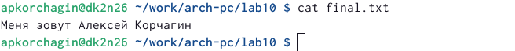

---
## Front matter
title: "Отчёт по лабороторной работе №10"
subtitle: "Работа с файлами средствами Nasm"
author: "Корчагин Алексей Павлович"

## Generic otions
lang: ru-RU
toc-title: "Содержание"

## Bibliography
bibliography: bib/cite.bib
csl: pandoc/csl/gost-r-7-0-5-2008-numeric.csl

## Pdf output format
toc: true # Table of contents
toc-depth: 2
lof: true # List of figures
lot: true # List of tables
fontsize: 12pt
linestretch: 1.5
papersize: a4
documentclass: scrreprt
## I18n polyglossia
polyglossia-lang:
  name: russian
  options:
	- spelling=modern
	- babelshorthands=true
polyglossia-otherlangs:
  name: english
## I18n babel
babel-lang: russian
babel-otherlangs: english
## Fonts
mainfont: PT Serif
romanfont: PT Serif
sansfont: PT Sans
monofont: PT Mono
mainfontoptions: Ligatures=TeX
romanfontoptions: Ligatures=TeX
sansfontoptions: Ligatures=TeX,Scale=MatchLowercase
monofontoptions: Scale=MatchLowercase,Scale=0.9
## Biblatex
biblatex: true
biblio-style: "gost-numeric"
biblatexoptions:
  - parentracker=true
  - backend=biber
  - hyperref=auto
  - language=auto
  - autolang=other*
  - citestyle=gost-numeric
## Pandoc-crossref LaTeX customization
figureTitle: "Рис."
tableTitle: "Таблица"
listingTitle: "Листинг"
lofTitle: "Список иллюстраций"
lotTitle: "Список таблиц"
lolTitle: "Листинги"
## Misc options
indent: true
header-includes:
  - \usepackage{indentfirst}
  - \usepackage{float} # keep figures where there are in the text
  - \floatplacement{figure}{H} # keep figures where there are in the text
---

# Цель работы

Преобрести навыки написания программ для работы с файлами NASM


# Теоретическое введение

Права доступа определяют набор действий (чтение, запись, выполнение), разрешённых для выполнения пользователям системы над файлами. Для каждого файла пользователь может входить в одну из трех групп: владелец, член группы владельца, все остальные. Для каждой из этих групп может быть установлен свой набор прав доступа.

Набор прав доступа задается тройками битов и состоит из прав на чтение, запись и исполнение файла. В символьном представлении он имеет вид строк rwx, где вместо любого символа может стоять дефис. Всего возможно 8 комбинаций, приведенных в таблице 10.1. Буква означает наличие права (установлен в единицу второй бит триады r — чтение, первый бит w — запись, нулевой бит х — исполнение), а дефис означает отсутствие права (нулевое значение соответствующего бита).

В операционной системе Linux существуют различные методы управления файлами, например, такие как создание и открытие файла, только для чтения или для чтения и записи, добавления в существующий файл, закрытия и удаления файла, предоставление прав доступа.

Обработка файлов в операционной системе Linux осуществляется за счет использования определенных системных вызовов. Для корректной работы и доступа к файлу при его открытии или создании, файлу присваивается уникальный номер (16-битное целое число) – дескриптор файла.

# Выполнение лабораторной работы

С помощью  mkdir создаю директорию lab10, перехожу в нее и создаю файл для работы(рис. @fig:001).

{#fig:001 width=70%}

Открываю созданный файл lab10-1.asm, вставляю в него программу из Листинга.(рис. @fig:002).

{#fig:002 width=70%}

Создаю исполняемый файл программы, а также сам файл, куда будет записываться строка. (рис. @fig:003).

{#fig:003 width=70%}

Проверяю работу программы.(рис. @fig:004).

{#fig:004 width=70%}

С помощью команды chmod изменяю права доступа к исполняемому файлу lab10-1, запретив его выполнение.(рис. @fig:005).

{#fig:005 width=70%}


В символьном представлении существует возможность явно указывать в какой группе какие права необходимо добавить или отменить. Так '6' дает право владельцу лишь на чтение и запись, но не на исполнения. '4' дает право группе лишь на чтения.
'0' оменяет все права для всех прочих пользователей.


С помощью команды chmod изменяю права доступа к файлу lab10-1.asm с исходным текстом программы, добавив права на исполнение. (рис. @fig:006).

{#fig:006 width=70%}


С Помощью аргументов "u" и "+" добавляем право владельцу на исполнение файла, однако в файле находится исходный код программы, который еще не ассемблирован, и потому его выполнение невозможно.
Происходит исполнение файла, но программа работать не будет.


В соответствии со своим 2-ым вариантом, предоставляю права доступа к файлу readme-1.txt представленные в символьном виде: rwx rwx --x. Вначале проверяю права, которые имеют пользователи при работе с файлом по умолчанию, затем даю ей другие права в соответствии с вариатном. (рис. @fig:007).

{#fig:007 width=70%}

Предоставляю права доступа к файлу readme-2.txt представленные в символьном – в двочном виде: 110 111 101, те есть 6 7 5 (рис. @fig:008).

{#fig:008 width=70%}

# Выполнение самостоятельной работы

Создал новый файл. Написал в его текст программы, запрашивающей имя пользователя и создающей файл, в который она будет записывать введённое имя(рис. @fig:009).

{#fig:009 width=70%}

Создаю исполняемый файл и запускаю его, ввожу свои имя и фамилию.(рис. @fig:010).

{#fig:010 width=70%}

С помощью cat проверяю содержимое созданного(рис. @fig:011).

{#fig:011 width=70%}


Код программы:
``` Nasm
%include 'in_out.asm'

SECTION .data
filename db 'final.txt', 0h ; Имя файла
msg db 'Как Вас зовут?  ', 0h ; Сообщение
msg1 db 'Меня зовут ', 0h ;

SECTION .bss
contents resb 255 ; переменная для вводимой строки
SECTION .text

global _start

_start:
	; --- Печать сообщения `msg`
mov eax,msg
call sprint
	; ---- Запись введеной с клавиатуры строки в `contents`
mov ecx, contents
mov edx, 255
call sread

	;--- Создание файла для записи имени
	
mov ecx,0777o ; разрешения
mov ebx,filename ; имя файла
mov eax,8 ; номер сис выозва для создание
int 80h

	; --- Открытие существующего файла (`sys_open`)
	
mov ecx,2 ; открываем для записи (2)
mov ebx,filename
mov eax,5
int 80h
	; --- Запись дескриптора файла в `esi`
	
mov esi,eax

	; --- Расчет длины введенной строки msg1
mov eax,msg1 
call slen 

	; --- Записываем в файл `msg1` (`sys_write`)
mov edx, eax
mov ecx, msg1
mov ebx, esi
mov eax, 4
int 80h

	; --- Расчет длины введенной строки
mov eax, contents ; в `eax` запишется количество
call slen ; введенных байтов

	; --- Записываем в файл `contents` (`sys_write`)
mov edx, eax
mov ecx, contents
mov ebx, esi
mov eax, 4
int 80h

	; --- Закрываем файл (`sys_close`)
mov ebx, esi
mov eax, 6
int 80h

call quit
```

# Выводы

В ходе выполненния лабороторной работы я приобрёл опыт работы с файлами в NASM

# Список литературы{.unnumbered}

::: {#refs}
:::
